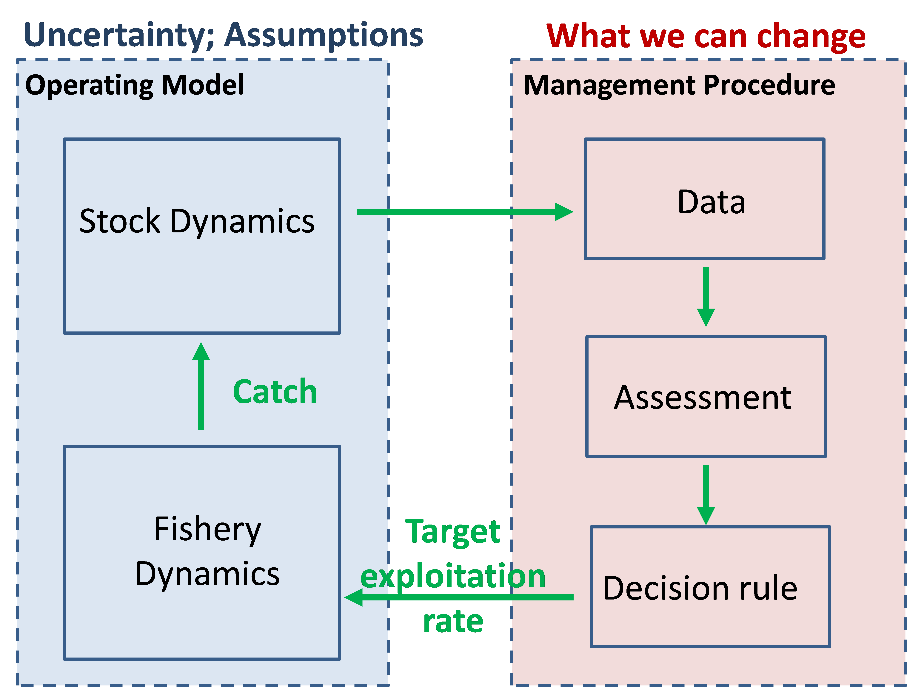
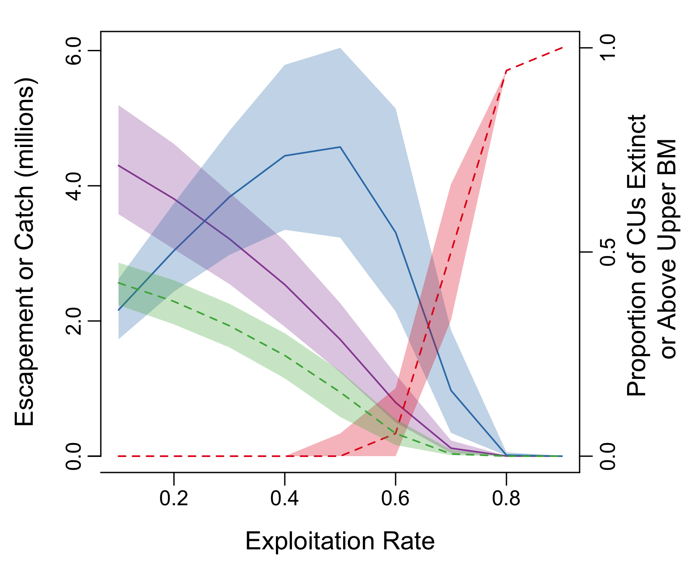
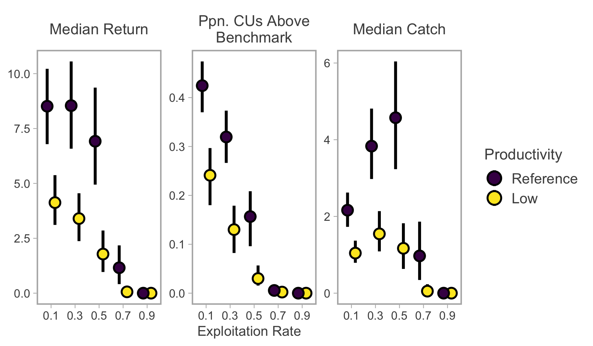
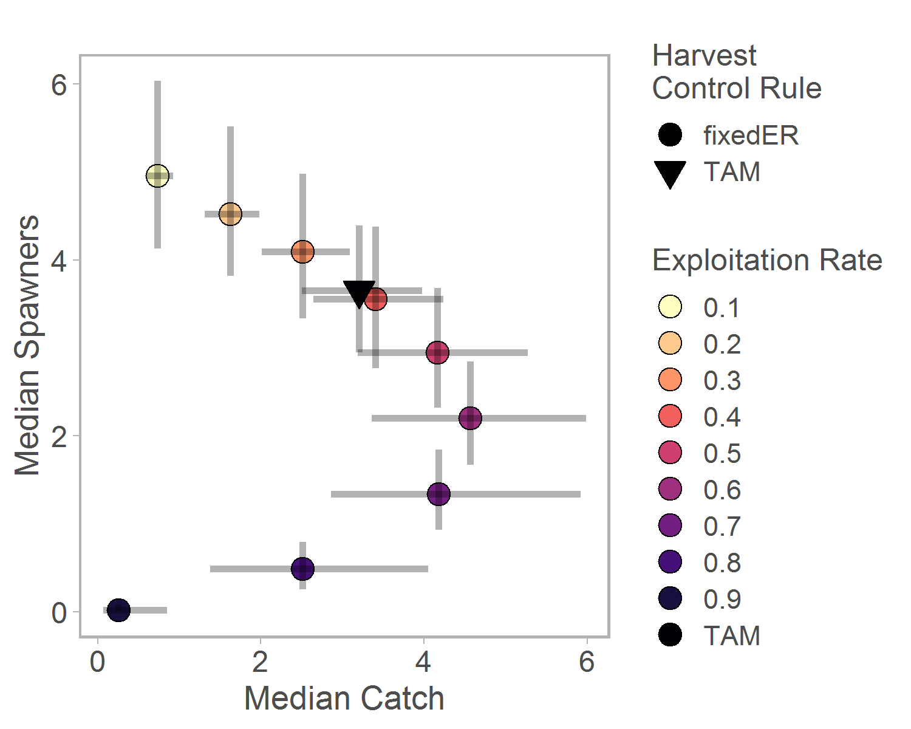
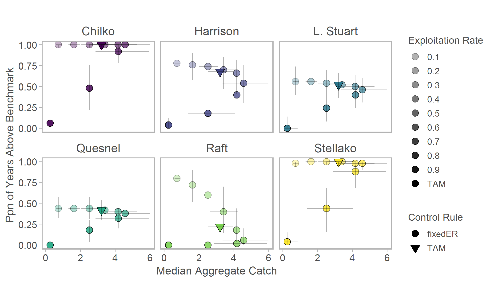
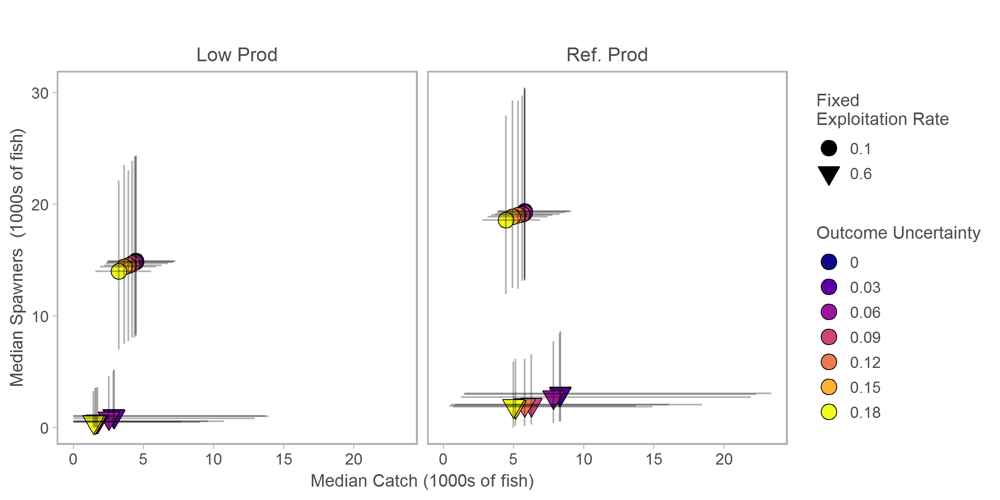

# Quantitative Tool for Evaluating Rebuilding

## Feedback simulations

Fisheries management is frequently tasked with implementing strategies that meet multiple, and often conflicting, broad objectives while remaining robust to sources of uncertainty. Management strategy evaluation (MSE) is a decision-making framework that allows scientists, managers, First Nations, and stakeholders to collaboratively develop and test alternative management procedures in a controlled and low-risk environment. In the MSE framework a management procedure is the combination of (i) a data collection scheme, (ii) a method of assessing CU status, and (iii) management actions based on estimated CU status (i.e., harvest control rules). The MSE process begins with the identification of fully-specified objectives (e.g., time to and probability of reaching specific recovery targets) and the development of management procedures that could realistically be implemented to meet those objectives. 

Once objectives and performance indicators have been identified, computer simulations are used to apply and evaluate different management procedures. In these simulations, real-world CUs and fisheries are replaced by a series of models that represent several distinct processes: the dynamics of fish populations, observations of these populations, and the behaviour of the fishery. Together these models constitute an operating model that represents a hypothesis about how the “true” system behaves. Importantly, these models include feedback from the impacts of management actions in a given year on the population size in the following year. The operating model is initially parameterized with historical data or representative values drawn from previous studies. 

A principal goal of this feedback simulation is to determine how robust distinct management procedures are to sources of uncertainty (e.g. form of stock-recruit relationships, precision of spawner abundance estimates, and implementation of harvest control rules). Multiple dimensions of uncertainty are incorporated into the simulation by designing several operating models, with each model containing unique combinations of parameter values and underlying model structures that represents a specific hypothesis about the system’s behaviour. Different management procedures are then applied to each operating model creating a suite of unique scenarios (each scenario equals one operating model and one management procedure). Every scenario is then iterated across many time steps to incorporate stochasticity and explore how the system is likely to behave in the future (Figure 1). Finally, management procedures are evaluated relative to one another based on their mean performance across many trials. By comparing how management procedures perform across multiple operating models, the simulation tool allows managers and stakeholders to assess trade-offs between exploitation/yield and conservation objectives under varying degrees of uncertainty. 

Although technically complex, feedback or "closed-loop" simulation models can be broken down into relatively simple components, including stock dynamics, collection of spawner and harvest data, assessment of status, application of harvest control rules, and implementation of a fishery (\@ref(fig:fig1)). The quantitative model described here can become the foundation for future MSE processes that would be developed in collaboration with First Nations and stakeholders. The structure of the model is described in more detail below. 


```{r fig1, fig.cap="Schematic of closed-loop simulation within Management Strategy Evaluation.", out.width=250}

```

These models are of little use without quantitative and realistic goals (e.g., those related to rebulding) that are actually relevant to management, and that can be used to assess the performance of management procedures. Ideally, these goals should include three components: a threshold representing CU status (e.g. a level of spawner abundance), a specified probability of reaching or avoiding the threshold, and a minimum/maximum number of years to reach the threshold. The Appendix includes a list of candidate objectives, performance metrics, and thresholds.

For this project, the overall goals of the simulation evaluation were identified through engagement with Fisheries Management at an initial Workshop in December 2017. These goals represented four different components and to date our efforts have focused on the first three. Preliminary results on the fourth are presented with additional recommendations for further work. Parentheses highlight the associated case study and published outputs which provide a more thorough description of the results. An overview of results are provided here.

1. Evaluate impact of candidate harvest strategies on rebuilding (Case Study 1: Fraser River sockeye salmon, @freshwater2019; @freshwater2020)  
2. Evaluate the impact of uncertainty in productivity and associated trends on rebuilding (Case Study 1, @freshwater2019; @freshwater2020).  
3. Evaluate impacts of combinations of mixed and single-stock fisheries on rebuilding (Case Study 1, @freshwater2019).  
4. Evaluate the impacts of uncertainties in assessment (changes in frequency and intensity of assessment) and from implementing management strategies (outcome uncertainties) on rebuilding and our ability to detect recovery. (Case Study 2: Nass River chum salmon)  


The Appendix includes a complete list of modules considered.

## samSim- A Generic Simulation tool

`samSim` is an R package containing functions to quantify the rebuilding potential for Pacific salmon populations. Within `samSim`, the primary function controlling the closed-loop simulation routine is named `recoverySim`. The model structure focuses on aggregates of salmon conservation units (CUs), the focal unit for assessing Pacific salmon status in Canada [@DFO2005]. Generally all CUs included within a single analysis should be managed simultaneously as a management unit (MU); however, the model can be adapted to include multiple MUs with distinct harvest rates. Although initial case studies focused on Fraser River sockeye salmon and Nass River (Area 3) chum salmon, `samSim` is intended to be applicable to any Pacific salmon species as long as two requirements are met. First, CU-specific stock-recruit parameters and age-at-maturity values must be available to parameterize the operating model. These values can either be derived from observed, CU-specific time series of age-structured spawner and recruit abundance or can be estimated using alternative techniques (e.g. habitat-based models; expert opinion). Second, harvest of immature fish must be considered negligible because offshore fisheries and/or stock distributions that remain in nearshore waters (and thus vulnerable to fisheries) throughout their lifecycle are not accounted for in the model. The code for `samSim` is available on GitHub at https://github.com/carrieholt/samSim.


`recoverySim` uses observed time series of spawner abundance to prime the simulation so that each CU's initial status reflects the most recent assessment. Those abundances, along with externally estimated stock-recruit parameters, are used as inputs to a Ricker model (Larkin models can also be used for cyclic CUs) that generates a cohort of _recruits_ (i.e. the total number of adult offspring produced by a given brood year of spawners). This process is stochastic, incorporating interannual variation in recruitment deviations, as well as covariance among CUs and temporal autocorrelation. Age-at-maturity varies among simulated recruits based on input parameters and multivariate logistic distribution. This process creates cohorts of _returns_, the total number of adult offspring returning to spawn in a given year, which consist of mature fish of various ages and brood years. 

Simulated returns may next be harvested by up to three discrete fisheries. The first fishery represents American harvest, which typically occurs during return migrations before Canadian CUs enter nearshore areas. American catches are always generated using a fixed exploitation rate that is passed as an input value. The second fishery represents Canadian mixed-CU harvest. Catch rates here are determined by one of three harvest control rules (HCRs): fixed exploitation rate, generic abundance-based, or total allowable mortality (TAM). The generic abundance-based HCR increases exploitation rates from a minimum value when return abundance exceeds user-specific reference points. The TAM rule is similar to the generic abundance-based HCR, but has additional modifications currently implemented in Fraser River sockeye salmon management [@pestal2011]. The third fishery represents near-terminal, single-stock harvest. While American and mixed-stock Canadian HCRs are a function of MU abundance, single-stock harvest is driven by abundance at the CU scale. Single-stock harvest is modeled as a proportion (0-1) of the mixed-stock total allowable catch, with the additional option to close specific CU's fisheries based on recent or forecasted abundance [@freshwater2020]. In each fishery, target catches (generated using the HCR) are converted to realized catches by incorporating stochastic outcome uncertainty [@holt2006]. In mixed-stock fisheries, CU-specific realized catch is then calculated as a function of relative abundance. Once catch has been removed the remaining returns become spawners, creating the subsequent generation of recruits. 

The simulation model produces a range of outputs automatically. A PDF of diagnostics contains simulated stock-recruit relationships, as well as time series of abundance, population parameters, and various performance metrics. Automatically generated R data and .csv files contain arrays of CU-specific time series, matrices of aggregate time series, and data frames of aggregate or CU-specific performance metrics. Each file contains all the Monte Carlo trials for a specific scenario. 

The output files are used by additional `samSim` functions to create various summary figures. Each figures incorporates percentile intervals that are calculated across Monte Carlo trials to provide an estimate of uncertainty. The `plotContTradeoffs` function generates double-y axis line plots that demonstrate how spawner abundance, stock status, and extinction probability change as exploitation rates increase within a single scenario (Fig. \@ref(fig:fig2)). 


```{r fig2, fig.cap="Changes in aggregate conservation- and catch-based performance metrics (escapement - purple; catch - blue; proportion of CUs above benchmark - green; extinction risk - red) as fixed exploitation rates increase. Dark lines represent median values and the shaded polygons the 90th percentile interval across Monte Carlo trials."}

```

The `plotAgDot` and `plotCUDot` functions provide summaries of multiple performance metrics (aggregate or CU-specific, respectively) across different management procedures or different operating models. For example, we can visualize declines in return size and the proportion of CUs above their biological benchmark as exploitation rates increase, as well as how such patterns differ among two different productivity regimes (Fig. \@ref(fig:fig3)).

```{r fig3, fig.cap="Performance across three metrics as a function of fixed exploitation rate (x-axis) and two productivity operating models (color). Points represent median values and whiskers the 90th percentile interval across Monte Carlo trials."}

```

The `plotAgTradeoff` and `plotCUTradeoff` functions plot a conservation metric on the x-axis and a catch metric on the y-axis to visualize how tradeoffs between objectives vary among management procedures or operating models. Such figures can be particularly useful in identifying subsets of management procedures that meet pre-specified objectives (e.g. minimum median return sizes and catches), while readily incorporating different operating models. For example, intermediate fixed exploitation rates or an abundance-based (TAM) harvest control rule may lead to optimal outcomes in a reference productivity scenario, but fail to meet threshold objectives when productivity is low (Fig. \@ref(fig:fig4)).

```{r fig4, fig.cap="Trade-offs between aggregate catch and escapement for fixed exploitation rate and total allowable mortality harvest control rules. Points represent median values and whiskers the 90th percentile interval across Monte Carlo trials. Fixed exploitation rates, FixedER, are shown with circles and a Total allowable Mortality, TAM, rule is shown with an inverted triangle.", out.width=250}

```


## Summary of Case Study on Fraser River sockeye salmon (Case Study 1)

We applied the quantitative tool first to a data-rich aggregate of 19 Fraser River sockeye salmon CUs to evaluate the impacts of various constant target exploitation rates and a “Total Allowable Mortality” (TAM) rule meant to represent a simplified version of the harvest control rule currently used for Fraser River sockeye salmon (see Freshwater et al. 2019 for details). We evaluated performance for aggregate spawner abundances against an arbitrary threshold of 3 million fish, and for aggregate catch against a threshold of 1 million fish, which approximates the minimum number required prior to opening Canadian commercial fisheries. 

We found exploitation rates between 20 and 40% generally achieved both objectives, as did the TAM rule (Fig. \@ref(fig:fig4)). However, for several of the component CUs spawner abundances were below lower biological benchmarks in a relatively high proportion of years (>25%) under all of these management procedures (e.g., Harrison, Late Stuart, Quensel, and Raft in Fig. \@ref(fig:fig5)). Only a subset of the 19 CUs that have similar similar summer run-timing and are managed together, are shown here. Further discussion on trade-offs among objectives under different productivity and in-river mortality scenarios are documented in Freshwater et al. [-@freshwater2019; -@freshwater2020].

```{r fig5, fig.cap="Trade-offs between aggregate catch (millions of fish) and the proportion of years above the lower biological benchmark for various fixed exploitation rates (circles) and the total allowable mortality (TAM)  harvest control rule (triangle). Points represent median values and whiskers the 90th percentile interval across Monte Carlo trials."}

```

## Summary of Case Study on Nass River Chum Salmon (Case Study 2)

The objective of the Nass River (Area 3) Chum rebuilding plan is to “protect Area 3 wild Chum and at the same time provide opportunities to retain enhanced US Chum in places and times where they are most abundant” @DFO2019b. Canadian catch of Area 3-origin chum salmon occurs primarily as by-catch in the sockeye salmon fishery. The Canadian exploitation rate is currently capped at 10% to allow for rebuilding of depleted CUs. The Nass River contains three CUs: Lower Nass, Portland Canal-Observatory, and Portland Inlet.

Our goal was to evaluate the impacts of outcome uncertainty on probability of rebuilding for component CUs. Outcome uncertainties, sometimes refered to as management or implementation uncertainties, are deviations between target and realized catch rates intended to represent imperfect management in a real-world system (e.g. unreported catch, delays in HCR implementation). Our primary question was, to what extent does variability in realized exploitation rates, occasionally above the 10% cap, limit ability for CUs to rebuild? Outcome uncertainties were included in the model and parameterized using observed exploitation rates (including US exploitation), relative to the 10% limit. We further explored a wide range in outcome uncertainties, including a scenario with no outcome uncertainty. We found that when multiple sources of uncertainty were considered in the operating model (e.g., natural variability in recruitment and age-at-maturity, alternative scenarios of productivity) and management procedure (e.g., observation errors), the relative impact of reducing outcome uncertainties was modest (Fig. \@ref(fig:fig6)). Although on average greater outcome uncertainty resulted in reduced spawner abundance and smaller catches over the long term because of intermittent overharvest, the additional sources of uncertainty (e.g., in productivity and population dynamics) tended to swamp signals from outcome uncertainties. Our results suggest that any reductions in outcome uncertainty would have minimal impacts on risks to rebuilding. In general, for data-limited stocks where uncertainties in population dyanmics are high, it is difficult to distinguish the performances of minor differences in management procedures.

```{r fig6, fig.cap="Trade-offs between median aggregate catch (1000s of fish) and the median aggregate spawner abundances (1000s fish) for outcome uncertainties from 0-0.18 standard deviations (colours) and for fixed exploitation rate equal to 0.1 (circles) and 0.6 (triangles). Left and right panels represent low and average productivity, respectively. Points represent median values and whiskers are 90th percentile acros Monte Carlo trials."}

```

